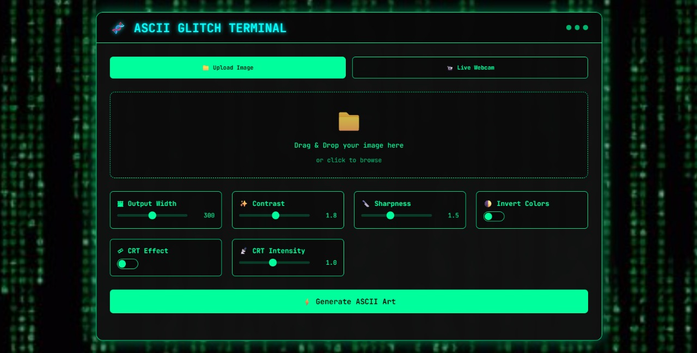
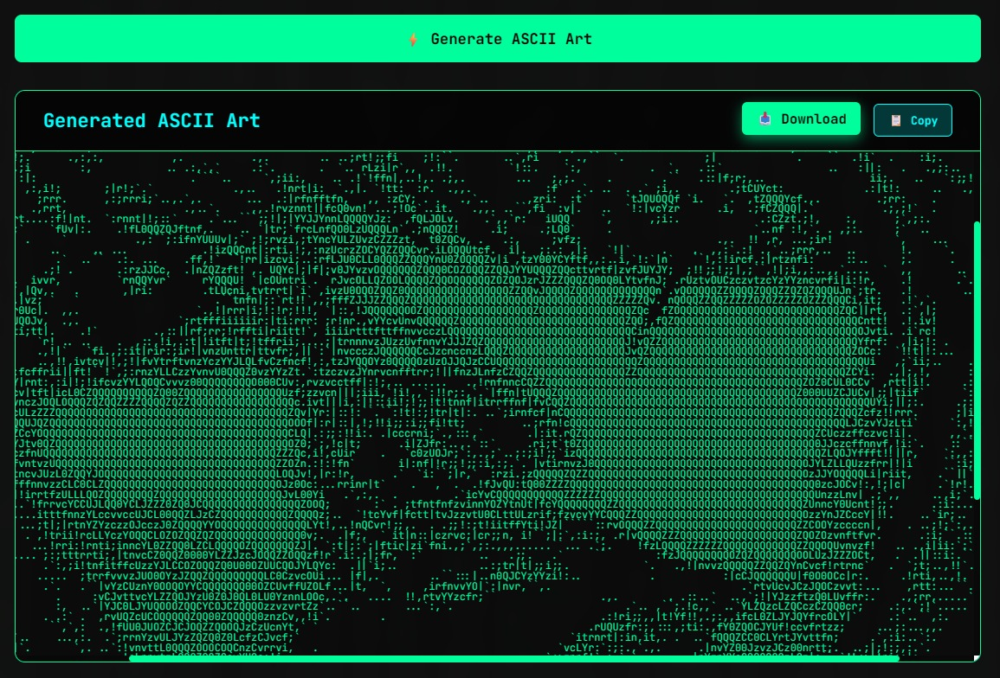

# 🧬 Glitch ASCII Art Generator


> A retro_matrix-inspired web app to generate stylized ASCII art from static images or live webcam feed — with glitch aesthetics, CRT effects, and customizable filters.

---

## 🌈 Demo Preview

<div align="center">
  
  <br><br>
  
</div>

---

## ✨ Features

- 🎨 **Image-to-ASCII Converter**
  - Upload any image
  - Adjust contrast, sharpness, and ASCII width
  - Enable/disable CRT distortion effect
  - Output downloadable `.txt` art file

- 📸 **Live Cam ASCII Mode**
  - Real-time ASCII transformation of your webcam feed using OpenCV
  - Retro terminal-style monochrome preview

- 🌗 **Custom Options**
  - ASCII width control
  - Inversion toggle (light/dark)
  - CRT intensity slider for glitch enthusiasts

---

## 🛠 Tech Stack

| Frontend         | Backend           | Others            |
|------------------|-------------------|-------------------|
| HTML, CSS (Retro) | Flask (Python)    | OpenCV, Pillow    |
| Vanilla JS       | PIL for image ops | ASCII Mapping / Filters |

---

## 📂 Folder Structure <br>

glitch-ascii/ <br>
├── app.py <br>
├── text_dither_art.py <br>
├── templates/ <br>
│ └── index.html <br>
├── static/ <br>
│ └── style.css <br>
├── uploads/ <br>
├── output/ <br>
└── assets/ <br>


---

## 🚀 How to Run Locally

### 1. Clone the repo

```bash
git clone https://github.com/Mevinmanuel/AGT-ascii_glitch_terminal.git
cd AGT-ascii_glitch_terminal
```

2. Install requirements

pip install -r requirements.txt
<br>

3. Run the Flask web app

python app.py
Open your browser and go to http://localhost:5000
<br>


⚙️ Customization Parameters <br>
| Parameter       | Type   | Description                           |
| --------------- | ------ | ------------------------------------- |
| `width`         | Number | Output character width (default: 300) |
| `invert`        | Bool   | Invert brightness to flip ASCII scale |
| `contrast`      | Float  | Contrast enhancement (default: 1.8)   |
| `sharpness`     | Float  | Sharpness level (default: 1.5)        |
| `crt`           | Bool   | Enable CRT glitch line distortion     |
| `crt_intensity` | Float  | Strength of CRT effect (default: 1.0) |


💡 Ideas to Extend <br>
🧬 AI/ML-based ASCII generator using Vision Transformers<br>

🌐 Deploy on Vercel + FastAPI or Render
<br><br>
📜 License<br>
MIT License. Feel free to fork and remix this project!
<br><br>
👨‍💻 Author<br>
Made with glitchy love by Your Mevin Manuel
